# Домашнее задание к занятию «Работа с данными (DDL/DML)» (Крюков Н.С.)


### Задание 1
1.1. Поднимите чистый инстанс MySQL версии 8.0+. Можно использовать локальный сервер или контейнер Docker.

```bash
wget -c https://dev.mysql.com/get/mysql-apt-config_0.8.30-1_all.deb
sudo dpkg -i mysql-apt-config_0.8.30-1_all.deb
sudo apt install mysql-server
sudo systemctl status mysql
sudo systemctl enable mysql
sudo mysql -u root -p
```

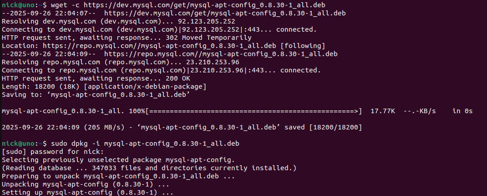
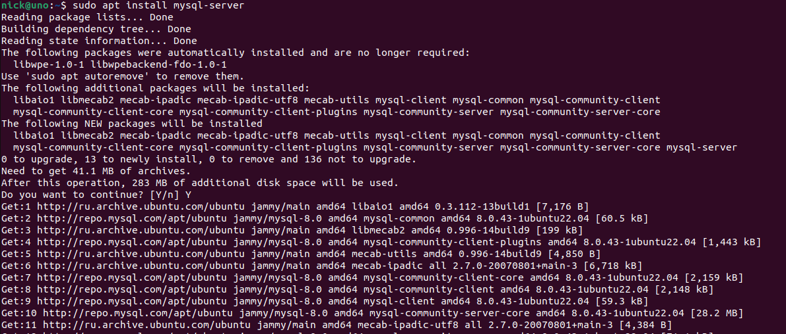
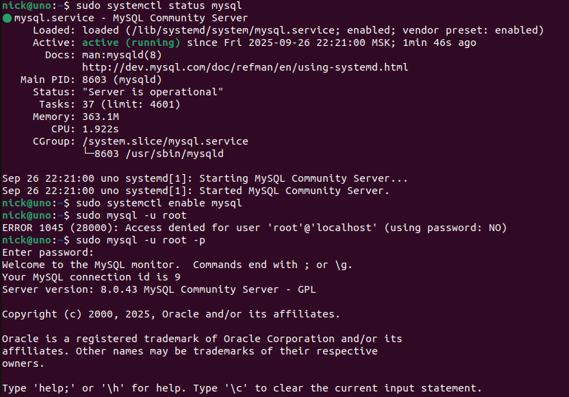

1.2. Создайте учётную запись sys_temp. 

```bash
CREATE USER 'sys_temp'@'localhost' IDENTIFIED BY '12345';
```

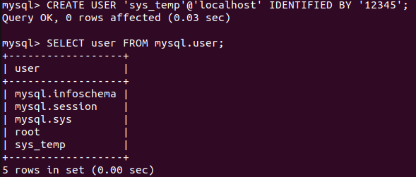

1.3. Выполните запрос на получение списка пользователей в базе данных. (скриншот)

```bash
SELECT user FROM mysql.user;
```


1.4. Дайте все права для пользователя sys_temp. 

```bash
GRANT ALL PRIVILEGES ON *.* TO 'sys_temp'@'localhost' WITH GRANT OPTION;
```


1.5. Выполните запрос на получение списка прав для пользователя sys_temp. (скриншот)

```bash
SELECT * FROM information_schema.user_privileges WHERE GRANTEE="'sys_temp'@'localhost'";
```

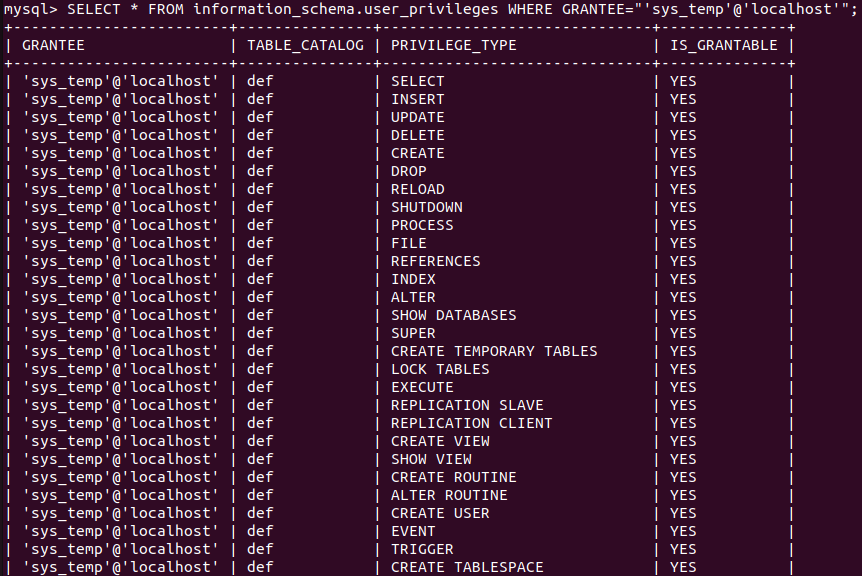
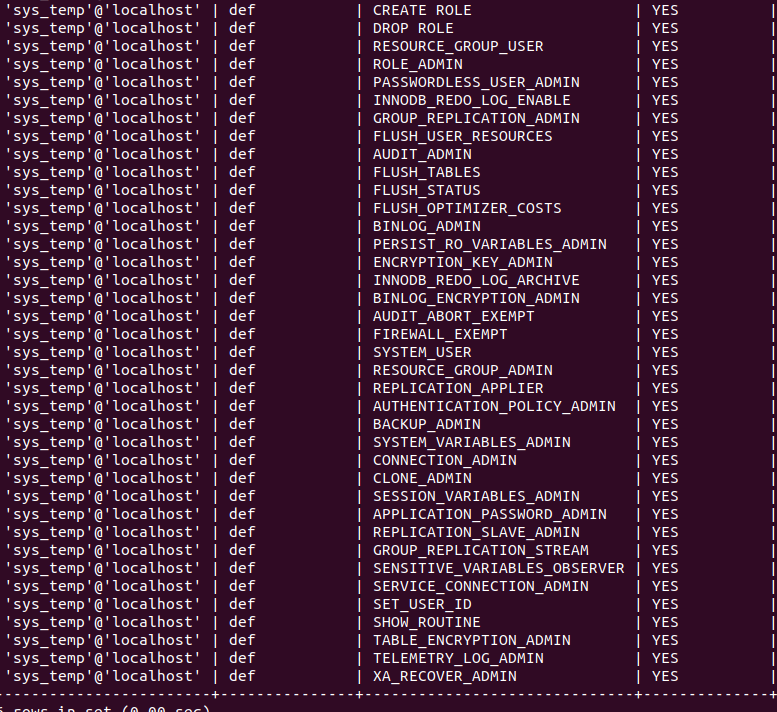


1.6. Переподключитесь к базе данных от имени sys_temp.

```bash
SYSTEM mysql -u sys_temp -p
SELECT user();
```

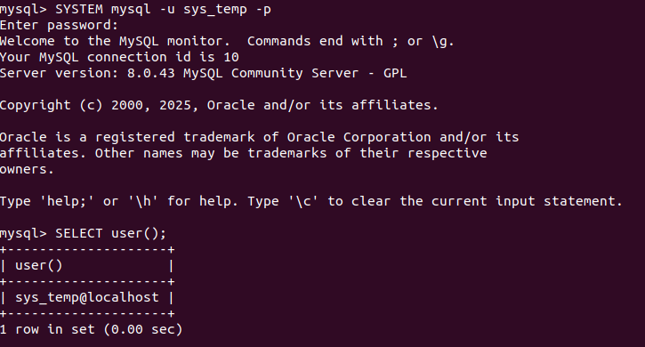


Для смены типа аутентификации с sha2 используйте запрос: 
```sql
ALTER USER 'sys_test'@'localhost' IDENTIFIED WITH mysql_native_password BY 'password';
```
1.6. По ссылке https://downloads.mysql.com/docs/sakila-db.zip скачайте дамп базы данных.

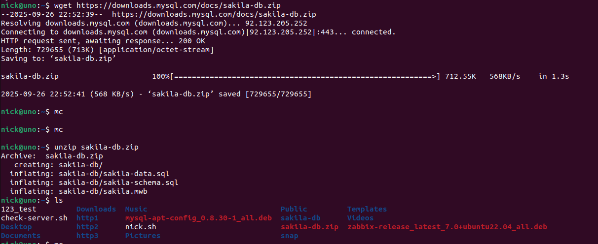

1.7. Восстановите дамп в базу данных.

```bash
source /home/nick/sakila-db/sakila-schema.sql
source /home/nick/sakila-db/sakila-data.sql
SHOW DATABASES;
```

1.8. При работе в IDE сформируйте ER-диаграмму получившейся базы данных. При работе в командной строке используйте команду для получения всех таблиц базы данных. (скриншот)

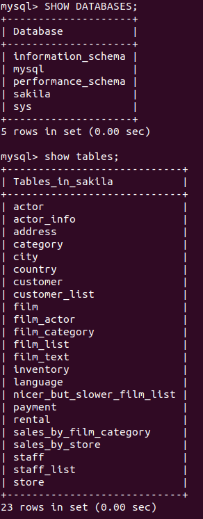
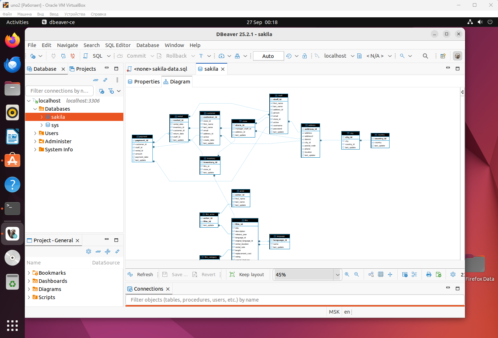


*Результатом работы должны быть скриншоты обозначенных заданий, а также простыня со всеми запросами.*


### Задание 2
Составьте таблицу, используя любой текстовый редактор или Excel, в которой должно быть два столбца: в первом должны быть названия таблиц восстановленной базы, во втором названия первичных ключей этих таблиц. Пример: (скриншот/текст)
```
Название таблицы | Название первичного ключа
customer         | customer_id
```

```bash
+---------------+--------------+
| TABLE_NAME    | COLUMN_NAME  |
+---------------+--------------+
| actor         | actor_id     |
| address       | address_id   |
| category      | category_id  |
| city          | city_id      |
| country       | country_id   |
| customer      | customer_id  |
| film          | film_id      |
| film_actor    | actor_id     |
| film_actor    | film_id      |
| film_category | film_id      |
| film_category | category_id  |
| film_text     | film_id      |
| inventory     | inventory_id |
| language      | language_id  |
| payment       | payment_id   |
| rental        | rental_id    |
| staff         | staff_id     |
| store         | store_id     |
+---------------+--------------+
```


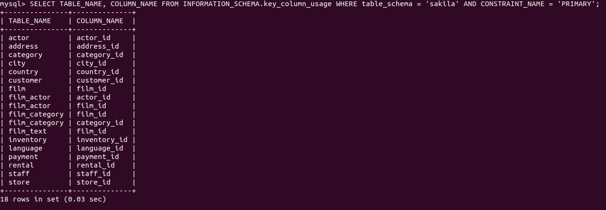


