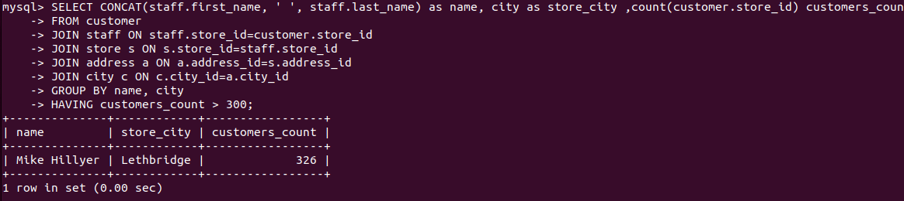
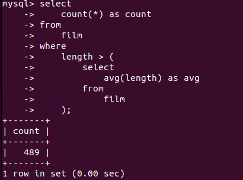
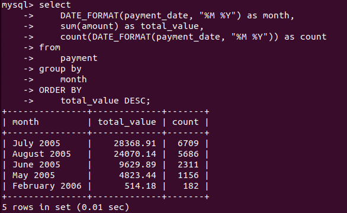

# Домашнее задание к занятию «SQL. Часть 2» (Крюков Н.С.)


### Задание 1

Одним запросом получите информацию о магазине, в котором обслуживается более 300 покупателей, и выведите в результат следующую информацию: 
- фамилия и имя сотрудника из этого магазина;
- город нахождения магазина;
- количество пользователей, закреплённых в этом магазине.

```sql
SELECT CONCAT(staff.first_name, ' ', staff.last_name) as name, city as store_city ,count(customer.store_id) customers_count
FROM customer
JOIN staff ON staff.store_id=customer.store_id
JOIN store s ON s.store_id=staff.store_id
JOIN address a ON a.address_id=s.address_id
JOIN city c ON c.city_id=a.city_id
GROUP BY name, city
HAVING customers_count > 300;
```



### Задание 2

Получите количество фильмов, продолжительность которых больше средней продолжительности всех фильмов.

```sql
select
    count(*) as count
from
    film
where
    length > (
        select
            avg(length) as avg
        from
            film
    );
```




### Задание 3

Получите информацию, за какой месяц была получена наибольшая сумма платежей, и добавьте информацию по количеству аренд за этот месяц.

```sql
select
    DATE_FORMAT(payment_date, "%M %Y") as month,
    sum(amount) as total_value,
    count(DATE_FORMAT(payment_date, "%M %Y")) as count
from
    payment
group by
    month
ORDER BY
    total_value DESC;
```



