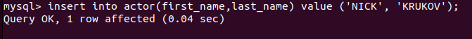
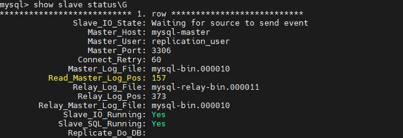
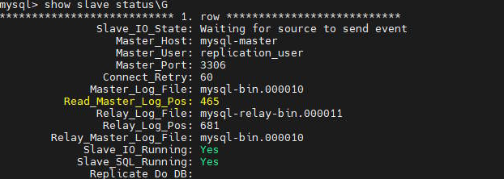

# Домашнее задание к занятию «Репликация и масштабирование. Часть 1» (Крюков Н.С.)


---

### Задание 1

На лекции рассматривались режимы репликации master-slave, master-master, опишите их различия.

*Ответить в свободной форме.*

Основное отличите между master-slave и master-master заключается в работе с данными. master-slave
Предполагает работу с мастером только для записи или изменения данных (INSERT/UPDATE/DELETE), чтение же
данных производится со slave. В случае схемы master-master любой из серверов может использоваться как для
чтения так и для записи. Преимуществом master-slave является возможность использования множества 
серверов slave для работы с одним сервером master, что снижает общую нагрузку.
Репликация master-slave используется для распределения нагрузки чтения из базы данных.
Репликация master-master нужна чтобы обеспечить высокую доступность и распределение нагрузки на запись.

---

### Задание 2

Выполните конфигурацию master-slave репликации, примером можно пользоваться из лекции.

*Приложите скриншоты конфигурации, выполнения работы: состояния и режимы работы серверов.*

SLAVE

```yml
# For advice on how to change settings please see
# http://dev.mysql.com/doc/refman/8.1/en/server-configuration-defaults.html

[mysqld]
log_bin = mysql-bin
server_id = 2
relay-log = /var/lib/mysql/mysql-relay-bin
relay-log-index = /var/lib/mysql/mysql-relay-bin.index
read_only = 1

default_authentication_plugin = caching_sha2_password
#require_secure_transport = ON

skip-host-cache
skip-name-resolve
datadir=/var/lib/mysql
socket=/var/run/mysqld/mysqld.sock
secure-file-priv=/var/lib/mysql-files
user=mysql

pid-file=/var/run/mysqld/mysqld.pid
[client]
socket=/var/run/mysqld/mysqld.sock

!includedir /etc/mysql/conf.d/

```

</details>

MASTER

```yml
# For advice on how to change settings please see
# http://dev.mysql.com/doc/refman/8.1/en/server-configuration-defaults.html

[mysqld]
default-authentication-plugin=mysql_native_password
server_id = 1
log_bin = mysql-bin

default_authentication_plugin = caching_sha2_password
#require_secure_transport = ON

skip-host-cache
skip-name-resolve
datadir=/var/lib/mysql
socket=/var/run/mysqld/mysqld.sock
secure-file-priv=/var/lib/mysql-files
user=mysql

pid-file=/var/run/mysqld/mysqld.pid
[client]
socket=/var/run/mysqld/mysqld.sock

!includedir /etc/mysql/conf.d/

```

</details>
---
Произвел запись в мастер:




До записи: 



И после записи:



---


