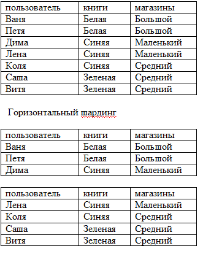
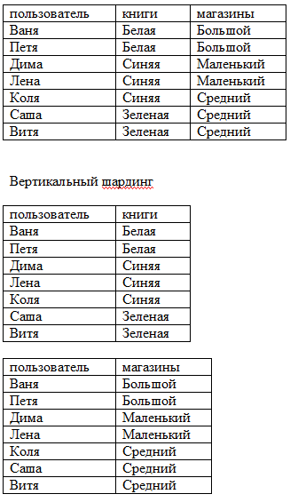

# Домашнее задание к занятию «Репликация и масштабирование. Часть 2»  (Крюков Н.С.)

### Задание 1

Опишите основные преимущества использования масштабирования методами:

- активный master-сервер и пассивный репликационный slave-сервер; 
- master-сервер и несколько slave-серверов;

# Ответ

Просто вариант репликации. Призван снизить нагрузку на мастера. Так же считается более надёжным, так как в
случае сбоя мастера, данные останутся на слейве. При этом слейв может стать мастером.

# Ответ

Более продвинутый вариант предыдущего метода. Отличается лучшим (на несколько слейвов) распределением
нагрузки и устойчивостью к сбоям.

---

### Задание 2

Разработайте план для выполнения горизонтального и вертикального шаринга базы данных. База данных состоит из трёх таблиц: 

- пользователи, 
- книги, 
- магазины (столбцы произвольно). 

Опишите принципы построения системы и их разграничение или разбивку между базами данных.

*Пришлите блоксхему, где и что будет располагаться. * 

-------------------------------
       

