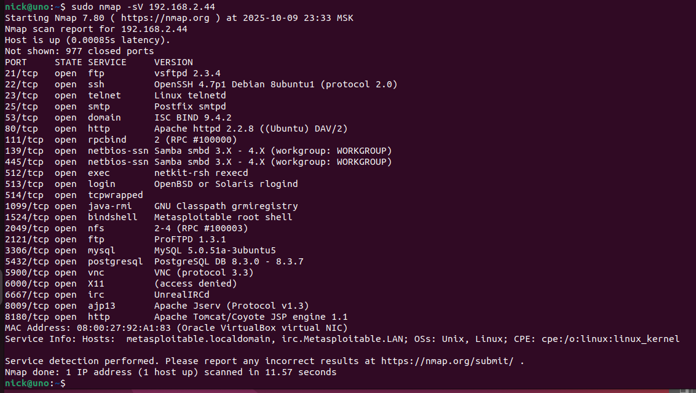
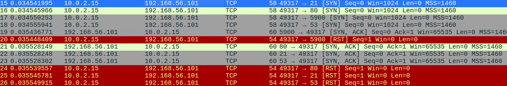
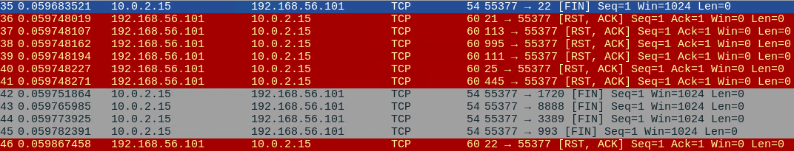
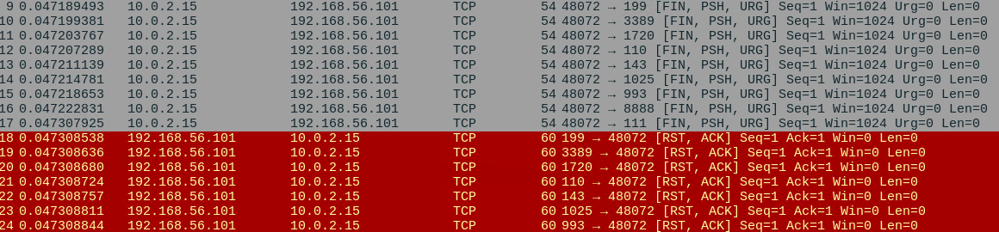
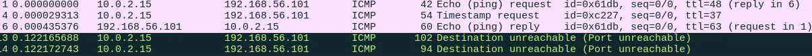

# Домашнее задание к занятию «Уязвимости и атаки на информационные системы» Крюков Н.С.

### Задание 1

Скачайте и установите виртуальную машину Metasploitable: https://sourceforge.net/projects/metasploitable/.

Это типовая ОС для экспериментов в области информационной безопасности, с которой следует начать при анализе уязвимостей.

Просканируйте эту виртуальную машину, используя **nmap**.

Попробуйте найти уязвимости, которым подвержена эта виртуальная машина.

Сами уязвимости можно поискать на сайте https://www.exploit-db.com/.

Для этого нужно в поиске ввести название сетевой службы, обнаруженной на атакуемой машине, и выбрать подходящие по версии уязвимости.

Ответьте на следующие вопросы:

- Какие сетевые службы в ней разрешены?
- Какие уязвимости были вами обнаружены? (список со ссылками: достаточно трёх уязвимостей)
  
### Решение

- Запуск утилиты nmap c ключём -sV позволяет определить список портов и доступных для идентификации
  служб, запущённых на удалённом компьютере.

- Для обнаружения уязвимостей можно воспользоваться:
  открытоыми базами данных на сайтах https://www.exploit-db.com/ или https://vulners.com/

## *Уязвимости*
vsftpd 2.3.4 - Backdoor Command Execution - https://www.exploit-db.com/exploits/49757

PostgreSQL 8.2/8.3/8.4 - UDF for Command Execution - https://www.exploit-db.com/exploits/7855

ProFTPd 1.3 - 'mod_sql' 'Username' SQL Injection - https://www.exploit-db.com/exploits/32798

### Задание 2

Проведите сканирование Metasploitable в режимах SYN, FIN, Xmas, UDP.

Запишите сеансы сканирования в Wireshark.

Ответьте на следующие вопросы:

- Чем отличаются эти режимы сканирования с точки зрения сетевого трафика?
- Как отвечает сервер?

## SYN-сканирование (-sS):
    Отправляются TCP SYN-пакеты.

    Если порт открыт — сервер отвечает SYN-ACK, далее nmap прерывает соединение (RST).

    Было обнаружено 30 открытых портов, включая FTP, SSH, HTTP, MySQL, PostgreSQL и др.

    Это самый информативный метод.

## FIN-сканирование (-sF):
    Если порт закрыт — сервер отвечает RST.

    Если открыт — сервер молчит.

## Xmas-сканирование (-sX)
    Поведение аналогично FIN: молчание = открыт, RST = закрыт.

## UDP-сканирование (-sU):
    Отправляются UDP-пакеты на все порты.

    В ответ — почти полное молчание или ICMP unreachable.

          